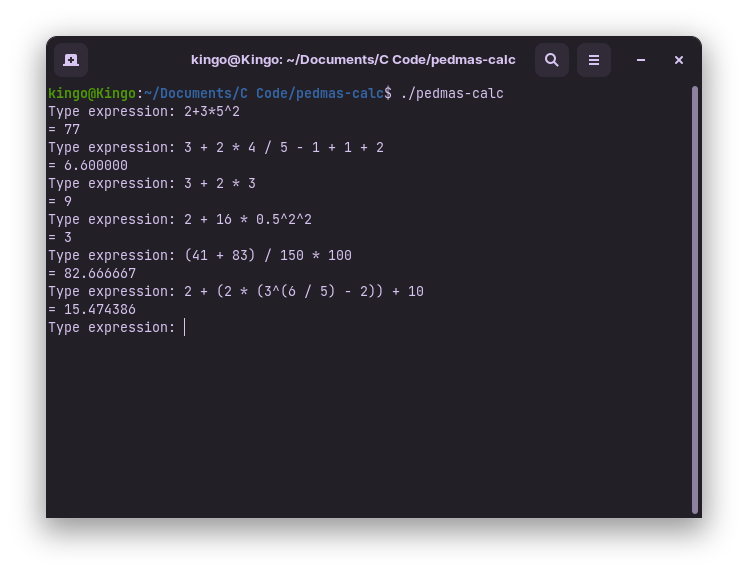
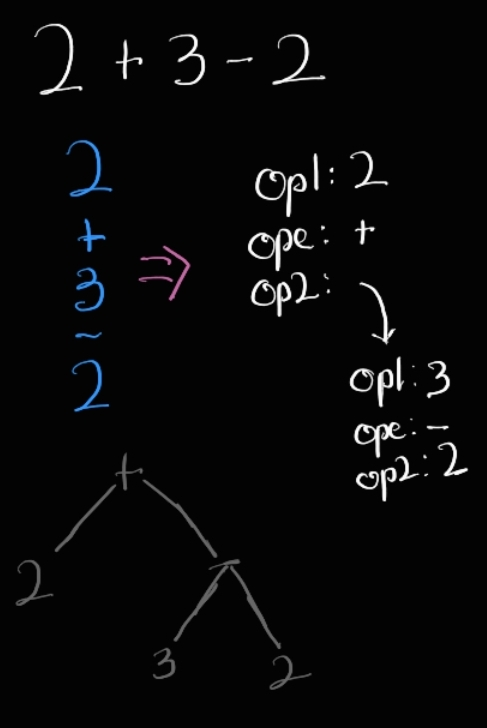

# PEDMAS Calculator
I plan on building an interpreter, so to prepare myself for the "mountain" of a task, I built a PEDMAS calculator. The reason I chose this project is because in building both an interpreter and a calculator, parsing has to be done.
- PEDMAS (`Parenthesis Exponents Division Multiplication Addition Subtraction`) is an order of operations rule that tells the correct sequence of evaluating a math expression.
- You can test it by typing `make` and running `./pedmas-calc`.



Parsing is the process of taking an input and turning it into logical and usable pieces.
In this project I take an expression (e.g. 2 + 3 * 5^2) and break it into different pieces called tokens, so I can better process the input. The complexity of the project is in the fact that different operations (`+, -, /, *, ^`) have different priorities. For example, in parsing the above expression, I can't just break it into simple pieces, but there has to be some form of nesting done to allow for accurate math evaluations.

## Implementation attempts
### First approach (Bare)
My first approach was to only give priority to addition and subtraction. No nesting was done here, but tokens that included `*, /, ^` were "manually" handled. I didn't use any data structures or recursion. Consequently, the code was very buggy and it was hard to implement more features like parentheses. The code can be found in the `arithmetic-without-parentheses` branch.

### Second attempt (Data Structure)
On my second attempt, I used a data structure. The data structure I used was a tree resembling an Abstract Syntax Tree (AST). It took the input and parsed it into a tree allowing for more flexibility and control.



The problem with this implementation was that it "parenthesized" the whole expression. For example
```
3 + 2 * 4 / 5 - 1 + 1 + 2
 => 3 + ((2 * (4 / 5)) - (1 + (1 + 2)))
```
The reason for this was because the tree created a form of hierarchy, which causes children nodes to be evaluated before they are accessed by parent nodes, hence creating parentheses. The code is in the `tree-implementation` branch.

### Current implementation (`main` branch)
I got rid of the tree DS and instead simultaneously parsed and evaluated the input, removing the parenthesis issue. I updated the parsing technique in the tree DS implementation to allow for selective parsing e.g.,
```
3 + 2 * 3
 => 3
    +
    2 * 3
```
It first separates the input by the operations with the least precedence (`+, -`). Remember that evaluation is done simultaneously, so the `3` is added to the `result` variable. Then it moves on to the next token (`2 * 3`). The parsing function is called again.
```
2 * 3
 => 2
    *
    3
```
This expression is evaluated and added to the `result` variable.

### More examples of current implementation
```
2 + 16 * 0.5^2^2
 => 2
    +
    16*0.5^2^2
     => 16
        *
        0.5^2^2
         => 0.5
            ^
            2
            ^
            2
```
```
(41 + 83) / 150 * 100
 => (41 + 83)
     => 41
        +
        83
    /
    150
    *
    100
```
```
2 + (2 * (3^(6 / 5) - 2)) + 10
 => 2
    +
    (2 * (3^(6 / 5) - 2))
     => 2 * (3^(6 / 5)
         => 2
            *
            3^(6 / 5)
             => 3
                ^
                (6 / 5)
                 => 6
                    /
                    5
        -
        2
    +
    10
```
---
Overall, it was a great introduction to parsing. Onward to making an interpreter! 🥳